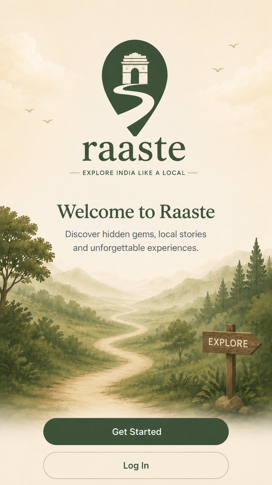
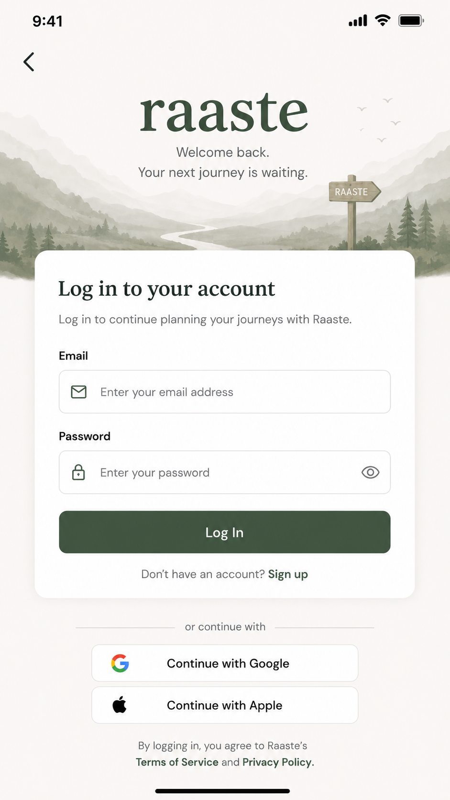
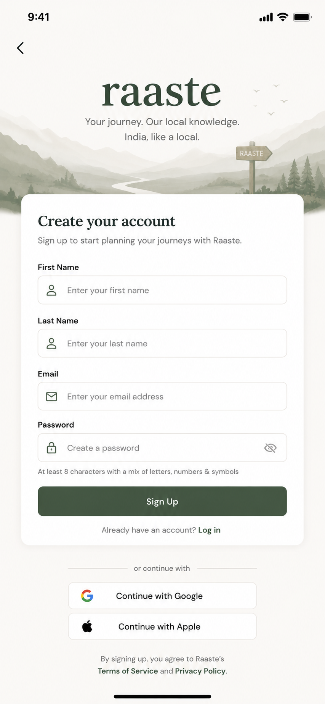
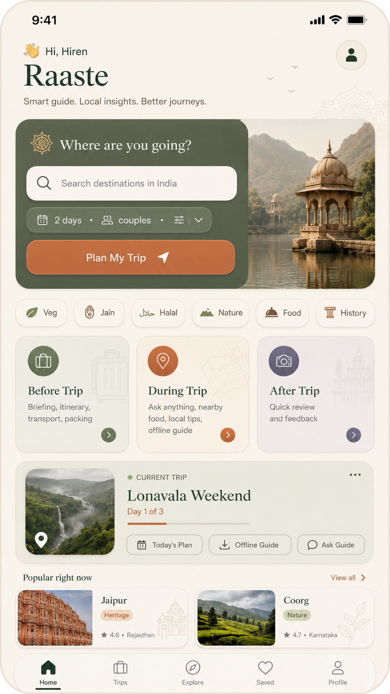
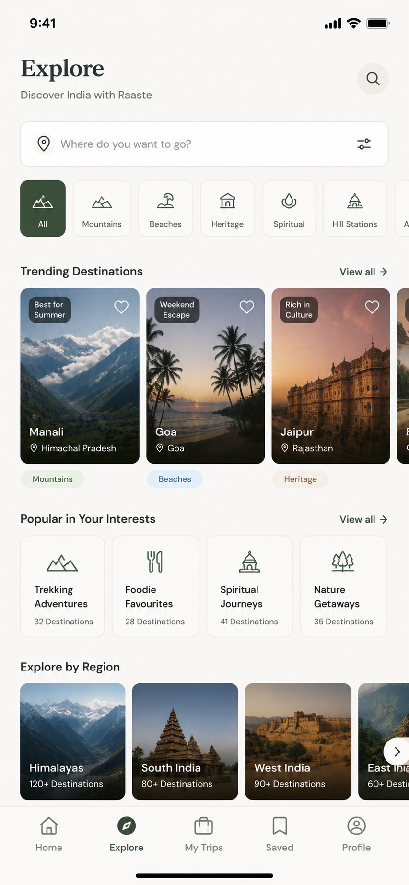
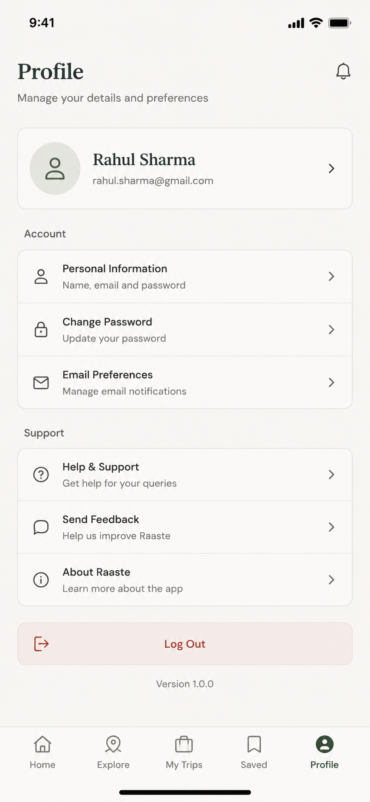

<p align="center">
  
</p>

<h1 align="center">Raaste</h1>

<p align="center">
  <strong>Explore India like a local.</strong><br>
  A personal, AI-powered travel guide for Indian domestic travel — before you go, while you're there, and after you leave.
</p>

<p align="center">
  
  
  
  
  
</p>

---

## 📱 App Preview

| Opening Screen | Welcome Screen | Login |
|:--:|:--:|:--:|
|  |  |  |

| Sign Up | Home | Explore |
|:--:|:--:|:--:|
|  |  |  |

| Profile |
|:--:|
|  |

---

## ✨ What is Raaste?

Raaste is your AI travel companion for discovering and experiencing India. It combines curated destination research, smart itinerary planning, an AI companion, restaurant recommendations, and interactive checklists — all tailored for Indian domestic travel.

The app is organized around three travel phases:

1. **Researcher (Before Trip)** — Discover destinations, read detailed guides, browse attractions, and build a personalized itinerary.
2. **Companion (During Trip)** — Ask the AI guide anything, find nearby restaurants, manage your trip checklist, and access saved trips offline.
3. **Debrief (After Trip)** — Share reviews and feedback that improve recommendations for future travelers.

---

## 🚀 Features

### Mobile App (Flutter)

- **Authentication** — Email/password and Google sign-in via Supabase Auth.
- **Home Dashboard** — Personalized greeting, smart destination search, dietary/travel-style filters, trip phase cards, current trip, and popular destinations.
- **Explore** — Browse by category (Mountains, Beaches, Heritage, Spiritual, Hill Stations), trending destinations, interests, and regions.
- **Destination Details** — Rich destination pages with research-backed guides and a conversational **Destination Chat** to ask questions.
- **Food & Restaurants** — Curated restaurant recommendations for destinations, filtered by dietary preferences and local cuisine.
- **Trip Planning** — Plan multi-day trips with day-by-day itineraries and packing checklists.
- **My Trips** — Save, view, and manage upcoming and past trips.
- **Checklists** — AI-generated packing and trip checklists, synced via Supabase.
- **AI Companion** — Ask travel questions and get contextual answers powered by OpenAI.
- **Profile** — Manage account details, preferences, and settings.

### Backend API (FastAPI)

- **Destinations** — Browse and search destinations with rich detail.
- **Trips** — Create trips and retrieve generated itineraries.
- **Checklists** — Generate and manage AI-powered trip checklists.
- **Companion** — Contextual AI Q&A using trip and destination data.
- **Reviews** — Submit post-trip reviews.
- **Auth / Profile** — JWT-based auth and user profile management.

---

## 🛠 Tech Stack

| Layer | Technology |
|-------|------------|
| Mobile app | Flutter, Dart |
| State management | BLoC / `flutter_bloc` |
| Navigation | `go_router` |
| Dependency injection | `get_it` |
| Networking | `dio`, Supabase client |
| Local storage | `shared_preferences` |
| Backend API | Python + FastAPI |
| Database | PostgreSQL |
| Auth & realtime | Supabase Auth / Supabase realtime |
| Cache & tasks | Redis + Celery |
| AI / LLM | OpenAI GPT |

---

## 📁 Monorepo Structure

```
Raaste/
├── apps/
│   └── mobile/                    # Flutter app
│       ├── lib/features/          # Feature-first modules
│       │   ├── auth/
│       │   ├── home/
│       │   ├── explore/
│       │   ├── destination/       # Destination detail + destination chat
│       │   ├── food/              # Restaurant recommendations
│       │   ├── trip/              # Trip planning, itinerary, saved trips
│       │   ├── checklist/         # AI-generated trip checklists
│       │   ├── companion/         # AI travel companion
│       │   ├── profile/
│       │   └── onboarding/
│       └── assets/research/       # Destination research JSON assets
├── services/
│   └── api/                       # FastAPI backend
│       ├── app/api/v1/endpoints/  # API routes
│       ├── app/services/          # Business logic
│       ├── app/models/            # SQLAlchemy models
│       ├── app/schemas/           # Pydantic schemas
│       └── app/jobs/              # Background jobs (Celery)
├── supabase/
│   └── migrations/                # Supabase SQL migrations
├── docs/                          # Product & architecture docs
├── docker-compose.yml             # Local infrastructure
└── README.md
```

---

## 🏗 Architecture

- **Mobile:** Feature-first, Clean Architecture-inspired folders (`data`, `domain`, `presentation`). BLoC handles auth state; screens use `StatefulWidget` + repositories for local/remote data. `go_router` manages deep links and tab navigation.
- **Backend:** Layered FastAPI app — endpoints depend on services, services depend on SQLAlchemy models. Pydantic schemas validate requests and responses.
- **Data flow:** Destination research is stored as JSON assets in the mobile app for fast offline access; trip data, checklists, and restaurants sync with Supabase/Postgres; AI features call OpenAI via the backend or directly from the mobile app depending on the feature.

Full details are in [`docs/ARCHITECTURE.md`](docs/ARCHITECTURE.md).

---

## 🚀 Getting Started

### Prerequisites

- Flutter SDK 3.7+ (stable)
- Python 3.11+
- Docker & Docker Compose (for Postgres/Redis)
- A Supabase project
- An OpenAI API key

### Mobile

```bash
cd apps/mobile
cp .env.example .env   # Add your SUPABASE_URL and SUPABASE_ANON_KEY
flutter pub get
flutter run
```

Required `.env` variables:

```env
SUPABASE_URL=https://your-project.supabase.co
SUPABASE_ANON_KEY=your-anon-key
```

### Backend

```bash
cd services/api
python -m venv .venv
source .venv/bin/activate  # On Windows: .venv\Scripts\activate
pip install -r requirements.txt
cp .env.example .env       # Add DATABASE_URL, OPENAI_API_KEY, SECRET_KEY, etc.
uvicorn app.main:app --reload
```

### Supabase Migrations

Apply the SQL migrations in `supabase/migrations/` to your Supabase project to create tables for saved trips, checklists, and restaurants.

### Infrastructure (local)

```bash
docker-compose up -d
```

This starts PostgreSQL and Redis for local development.

---

## 📡 Backend API

FastAPI auto-generates interactive docs at:

- Swagger UI: http://localhost:8000/docs
- ReDoc: http://localhost:8000/redoc

Key endpoints:

| Method | Endpoint | Description |
|--------|----------|-------------|
| POST | `/api/v1/auth/otp/send` | Request an OTP |
| POST | `/api/v1/auth/otp/verify` | Verify OTP and receive a JWT |
| GET | `/api/v1/destinations` | Browse/search destinations |
| GET | `/api/v1/destinations/{slug}` | Destination details |
| POST | `/api/v1/trips` | Create a trip |
| GET | `/api/v1/trips/{trip_id}` | Get trip itinerary |
| GET/POST | `/api/v1/checklists/*` | Generate and manage checklists |
| POST | `/api/v1/companion/ask` | Ask the AI travel companion |
| POST | `/api/v1/reviews` | Submit a post-trip review |
| GET/PUT | `/api/v1/profile/me` | User profile |

See [`docs/API_CONTRACTS.md`](docs/API_CONTRACTS.md) for the full contract.

---

## 🧪 Running Tests

### Backend

```bash
cd services/api
source .venv/bin/activate  # On Windows: .venv\Scripts\activate
pytest
```

### Mobile

```bash
cd apps/mobile
flutter test
flutter analyze
```

---

## 📄 Documentation

- [`docs/PRODUCT_CONTEXT.md`](docs/PRODUCT_CONTEXT.md) — Product vision, target audience, the three phases, and monetisation model
- [`docs/ARCHITECTURE.md`](docs/ARCHITECTURE.md) — System architecture and tech decisions
- [`docs/API_CONTRACTS.md`](docs/API_CONTRACTS.md) — Backend API contracts

---

## 🗺 Roadmap / Current Status

Implemented:
- [x] Splash, onboarding, auth (email + Google)
- [x] Home dashboard with search and filters
- [x] Explore with categories, trending, and regions
- [x] Destination detail and destination chat
- [x] Trip planning and itinerary
- [x] Saved trips (My Trips)
- [x] AI-generated checklists
- [x] Restaurant / food recommendations
- [x] AI companion
- [x] Profile and settings
- [x] FastAPI backend with destinations, trips, companion, reviews, checklists, profile
- [x] Supabase migrations

In progress / planned:
- [ ] Full backend-mobile API integration for all features
- [ ] Offline mode for core destination content
- [ ] Post-trip review flow in the mobile app
- [ ] Monetisation features (trip passes, partner listings)

---

## 🤝 Contributing

Raaste is an active work in progress. If you want to contribute, start by reading the docs in the `docs/` folder and then pick up an open issue or improvement area.

---

## 📝 License

This project is proprietary and maintained by the Raaste team.

---

<p align="center">
  Made with ❤️ for travelers in India.
</p>
